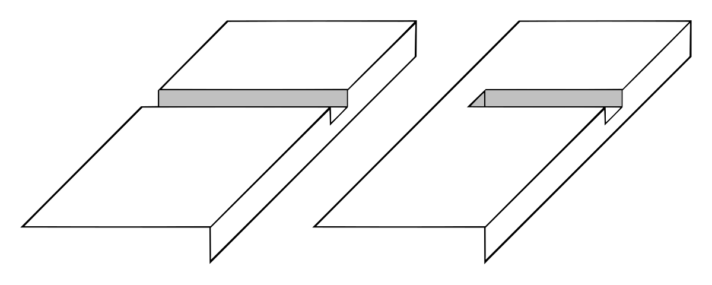
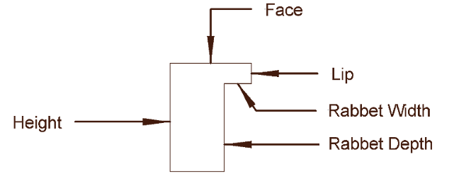

# Woodworking Tool Guide
A beginner's guide to woodworking as written by your son

Each tool section will have a list of features / variations to look for, what they mean, and then some concrete recommendations at the end of the section.

## Router
A router is a versatile tool that can help you with the following cuts:

1. Clean, even edges
2. Molding
3. Cutting a dado1
4. Rabbets 2
5. And more

<figure>
    
    <figcaption>1 Dado</figcaption>
</figure>

<figure>
    
    <figcaption>2 Rabbet</figcaption>
</figure>

### Bases
There are two types of handheld routers: A `fixed` base and a `plunge` base. A `fixed` base is more of a specialized tool that you can only use on the edges of a piece of wood. `Plunge` bases allow you to move the router wherever it needs to go. Some routers will come with both a `fixed` and `plunge` bases for easy switching (and less $$ than two routers)
> Recommendation: **Plunge Base**

Also look for an adjustable depth on the `plunge` base, so you only cut as deep as needed

### Drive Shaft Size
Router collets come in $$\frac{1}{2}$$" or $$\frac{1}{4}$$" shafts. $$\frac{1}{2}$$" bits don't wear out as easily, and you can attach $$\frac{1}{4}$$" bits with an attachment or swapping out the collet.

> Recommendation: **$$\frac{1}{2}$$" Shaft**

### Depth Adjustment
This is a feature that lets you dial in exactly how deep you want a cut to go. 

### Motor Speed
Many modern routers come with some way to adjust the speed of the motor. This system is called `EVS` (*electronic variable speed*). This allows you to slow down larger bits, or slow down when cutting through material that burns easily. 

With `EVS` can come a feature called `Soft Start`, which slowly spins up the motor over $$~3$$ seconds, rather than spinning up from $$0 - 20000$$ rpm as quickly as possible. This helps the motor last longer.

Lastly, there's `IFS`, or *Integrated Feedback System*. This means that the tool will try to keep the bit spinning at the same rpm, no matter if it's not cutting through anything, or some really dense material.

> Recommendation: At least `EVS`. `Soft Start` and `IFS` are nice, but probably not as important

### Motor Power
Different companies like to advertise and measure their tools' power in different ways (read: lie about it), so you have to look for a `UL rating`. It's an independent organization that rates continual power of motors. For a handheld router, most people recommend $$11 \text{ or }12\text{ A}$$

> Recommendation: Look for a $$11\text{ A or }12 \text{ A}$$ `UL` rating
>
> $$\frac{12 \text{ A} \times 110\text{ V}}{746} = 1.93\text{ HP}$$
> 
> $$\frac{11 \text{ A} \times 110\text{ V}}{746} = 1.62\text{ HP}$$

### Options
DeWalt Kit

DW618PKB

$229 (individual motor + 2 mounts = $335. Get the kit)
- [x] $$\frac{1}{2}$$" (with adapter for $$\frac{1}{4}$$")
- [x] Plunge and fixed kit
- [x] $$12\text{ A}$$
- [x] Depth Adjustment - not as precise as advertised
- [x] EVS
- [x] Soft Start
- [ ] IFS
- [ ] Dust Collection - only on plunge base

---

Bosch Kit

*1617EVSPK*

$199 (fixed base / mount + plunge mount = $261. Get the kit)
- [x] $$\frac{1}{2}$$" (with $$\frac{1}{4}$$" collet)
- [x] Plunge and fixed kit
- [x] $$12\text{ A}$$
- [x] Depth Adjustment (down to $$\frac{1}{64}$$")
- [x] EVS
- [x] Soft Start
- [x] IFS
- [x] Dust Collection

---

Metabo Kit (aka Hitachi)

*KM12VC*

$179
- [x] $$\frac{1}{2}$$" (with $$\frac{1}{4}$$" collet)
- [x] Plunge and fixed kit
- [x] $$11\text{ A}$$
- [x] Depth Adjustment
- [x] EVS
- [x] Soft Start
- [x] IFS
- [x] Dust Collection

All of these options will fit at least the JessEm router lift, and the Ryobi Universal Router Table for if / when you want to expand.
